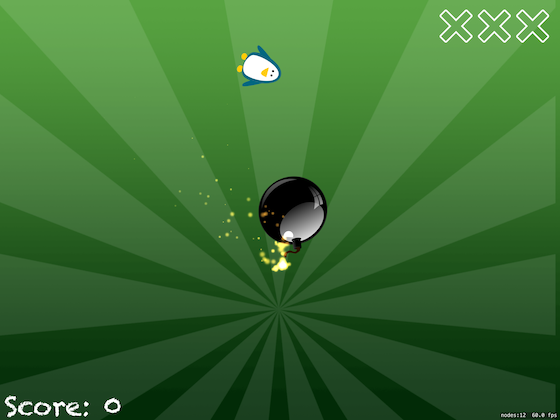

# Swifty Ninja (SpriteKit)

## Description
Draw shapes in SpriteKit while making a fun and tense slicing game

### Steps to clean a new SpriteKit project.
* On `GameScene.sks`
  * Delete the **Hello World `Node`**
  * On `attributes inspector` from `GameScene.sks`:
    * Change the `anchor point` for **`X`:0 `Y`:0**.
    * Change the size for **W:1024** **H:768** to match iPad `landscape` size.
        > Although there are iPads much bigger, `SpriteKit` takes care of it, so don't worry about this size.
* Delete `Actions.sks`, move it to trash.
* On `GameScene.swift`
  * Delete the two properties
  * Delete all the code inside `didMove(to:)`
  * Delete the other methods

## Tags
The application was created in step-by-step, so if you want to look through each part, here are some tags that goes through the developing path.

### [Setting up](https://github.com/fdorado985/SwiftyNinja/tree/setting-up)
| Screenshot 01 |
| ------------- |
|  |

### [Basics quick start: SKShapeNode](https://github.com/fdorado985/SwiftyNinja/tree/basics-quick-start-skshapenode)
| Screenshot 02 |
| ------------- |
|  |

### [Shaping up for action: CGPath and UIBezierPath](https://github.com/fdorado985/SwiftyNinja/tree/shaping-up-for-action-cgpath-and-uibezierpath)
| Screenshot 03 |
| ------------- |
|  |

### [Enemy or bomb: AVAudioPlayer](https://github.com/fdorado985/SwiftyNinja/tree/enemy-or-bomb-avaudioplayer)
> It is basically same status as before but now with the logic to be able to create enemies, and bombs their position, movement and velocity.
> 
| Screenshot 03 |
| ------------- |
|  |

### [Follow the sequence](https://github.com/fdorado985/SwiftyNinja/tree/follow-the-sequence)
| Screenshot 04 |
| ------------- |
|  |